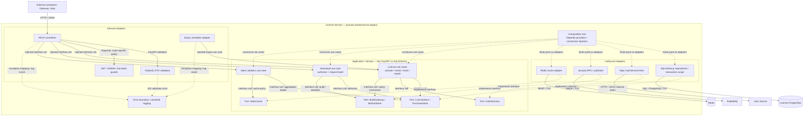

# C4 Level 3 — License Service

[Опис і трасування в Розділі 2](../2_design.md#diagram-level3) · [Mermaid source](c4-component.mmd).

```mermaid
flowchart TB
  Caller["External containers: Gateway / bots"]
  PG[("License PostgreSQL")]
  UserAPI["User Service"]
  MQ["RabbitMQ"]
  Redis[("Redis")]
  subgraph License["License Service — цільова компонентна модель"]
    subgraph Inbound["Inbound adapters"]
      API["REST controllers"]
      DTO["Pydantic DTO validation"]
      Guard["JWT / ADMIN / bot-token guards"]
      Worker["Expiry scheduler adapter"]
    end
    subgraph Core["Application / domain — без FastAPI та SQLAlchemy"]
      UseCases["License use cases<br/>activate / check / reset / expire"]
      Download["Download use case<br/>authorize + request build"]
      Stats["Sales statistics use case"]
      RP["Port: LicenseStore / PurchaseStore"]
      UP["Port: UserDirectory"]
      MP["Port: BuildGateway / BotPublisher"]
      CP["Port: StatsCache"]
    end
    subgraph Outbound["Outbound adapters"]
      Repo["SQLAlchemy repositories / transaction scope"]
      HTTP["httpx UserServiceClient"]
      AMQP["aio-pika RPC / publisher"]
      Cache["Redis cache adapter"]
    end
    Wiring["Composition root<br/>Depends providers / constructor injection"]
    Errors["Error boundary / sanitized logging"]
  end
  Caller -->|"HTTP / JSON"| API
  API -->|"FastAPI validation"| DTO
  API -->|"Depends: route-specific policy"| Guard
  API -->|"injected interface call"| UseCases
  API -->|"injected interface call"| Download
  API -->|"injected interface call"| Stats
  Worker -->|"injected expire use case"| UseCases
  UseCases -->|"interface call"| RP
  UseCases -->|"interface call"| UP
  UseCases -->|"interface call: expiry commands"| MP
  Download -->|"interface call: authorize"| RP
  Download -->|"interface call: build / deadline"| MP
  Stats -->|"interface call: aggregates loader"| RP
  Stats -->|"interface call: cache policy"| CP
  Repo -.->|"implements interface"| RP
  HTTP -.->|"implements interface"| UP
  AMQP -.->|"implements interface"| MP
  Cache -.->|"implements interface"| CP
  Wiring -.->|"binds ports to adapters"| Repo
  Wiring -.->|"binds ports to adapters"| HTTP
  Wiring -.->|"binds ports to adapters"| AMQP
  Wiring -.->|"binds ports to adapters"| Cache
  Wiring -.->|"constructs use cases"| UseCases
  Wiring -.->|"constructs use cases"| Download
  Wiring -.->|"constructs use cases"| Stats
  API -.->|"exception mapping / log event"| Errors
  Worker -.->|"exception mapping / log event"| Errors
  DTO -.->|"422 validation error"| Errors
  Repo -->|"SQL / PostgreSQL TCP"| PG
  HTTP -->|"HTTP / JSON: internal token"| UserAPI
  AMQP -->|"AMQP / TCP"| MQ
  Cache -->|"RESP / TCP"| Redis
```

