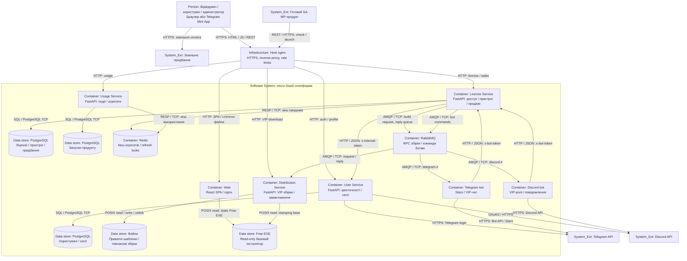

# C4 Level 2 — Container

[Опис і трасування в Розділі 2](../2_design.md#diagram-level2) · [Mermaid source](c4-container.mmd).

```mermaid
flowchart TB
  Browser["Person: Відвідувач / користувач / адміністратор<br/>Браузер або Telegram Mini App"]
  Product["System_Ext: Готовий SA-MP-продукт"]
  TG["System_Ext: Telegram API"]
  DC["System_Ext: Discord API"]
  Market["System_Ext: Зовнішнє придбання"]
  Gateway["Infrastructure: Host nginx<br/>HTTPS, reverse proxy, rate limits"]
  subgraph Platform["Software System: micro-SaaS-платформа"]
    Web["Container: Web<br/>React SPA / nginx"]
    UserAPI["Container: User Service<br/>FastAPI: ідентичності / сесії"]
    License["Container: License Service<br/>FastAPI: доступ / пристрої / продажі"]
    Usage["Container: Usage Service<br/>FastAPI: події / агрегати"]
    Dist["Container: Distribution Service<br/>FastAPI: VIP-збірки / завантаження"]
    UDB[("Data store: PostgreSQL<br/>Користувачі / сесії")]
    LDB[("Data store: PostgreSQL<br/>Ліцензії / пристрої / придбання")]
    SDB[("Data store: PostgreSQL<br/>Запуски продукту")]
    Redis[("Container: Redis<br/>Кеш агрегатів / refresh locks")]
    MQ["Container: RabbitMQ<br/>RPC збірки / команди ботам"]
    TBot["Container: Telegram bot<br/>Stars / VIP-чат"]
    DBot["Container: Discord bot<br/>VIP-ролі / повідомлення"]
    Files[("Data store: Файли<br/>Приватні шаблони / тимчасові збірки")]
    Free[("Data store: Free EXE<br/>Read-only базовий інсталятор")]
  end
  Browser -->|"HTTPS: HTML / JS / REST"| Gateway
  Product -->|"REST / HTTPS: check / launch"| Gateway
  Gateway -->|"HTTP: SPA / статичні файли"| Web
  Gateway -->|"HTTP: auth / profile"| UserAPI
  Gateway -->|"HTTP: license / sales"| License
  Gateway -->|"HTTP: usage"| Usage
  Gateway -->|"HTTP: VIP download"| Dist
  UserAPI -->|"SQL / PostgreSQL TCP"| UDB
  License -->|"SQL / PostgreSQL TCP"| LDB
  Usage -->|"SQL / PostgreSQL TCP"| SDB
  License -->|"HTTP / JSON: x-internal-token"| UserAPI
  License -->|"RESP / TCP: кеш продажів"| Redis
  Usage -->|"RESP / TCP: кеш використання"| Redis
  License -->|"AMQP / TCP: build request, reply queue"| MQ
  MQ -->|"AMQP / TCP: request / reply"| Dist
  License -->|"AMQP / TCP: bot commands"| MQ
  MQ -->|"AMQP / TCP: telegram.#"| TBot
  MQ -->|"AMQP / TCP: discord.#"| DBot
  TBot -->|"HTTP / JSON: x-bot-token"| License
  DBot -->|"HTTP / JSON: x-bot-token"| License
  UserAPI -->|"HTTPS: Telegram login"| TG
  UserAPI -->|"OAuth2 / HTTPS"| DC
  TBot -->|"HTTPS: Bot API / Stars"| TG
  DBot -->|"HTTPS: Discord API"| DC
  Web -->|"POSIX read: static Free EXE"| Free
  Dist -->|"POSIX read: stamping base"| Free
  Dist -->|"POSIX read / write / unlink"| Files
  Browser -->|"HTTPS: зовнішня оплата"| Market
```

