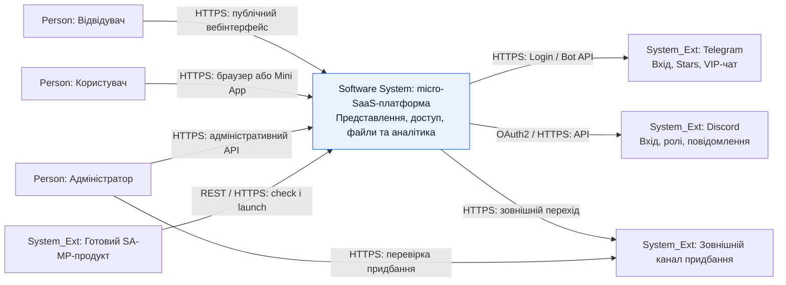

# C4 Level 1 — System Context

[Опис і трасування в Розділі 2](../2_design.md#diagram-level1) · [Mermaid source](c4-context.mmd).

```mermaid
flowchart LR
  Guest["Person: Відвідувач"]
  User["Person: Користувач"]
  Admin["Person: Адміністратор"]
  Platform["Software System: micro-SaaS-платформа<br/>Представлення, доступ, файли та аналітика"]
  Product["System_Ext: Готовий SA-MP-продукт"]
  Telegram["System_Ext: Telegram<br/>Вхід, Stars, VIP-чат"]
  Discord["System_Ext: Discord<br/>Вхід, ролі, повідомлення"]
  Market["System_Ext: Зовнішній канал придбання"]
  Guest -->|"HTTPS: публічний вебінтерфейс"| Platform
  User -->|"HTTPS: браузер або Mini App"| Platform
  Admin -->|"HTTPS: адміністративний API"| Platform
  Product -->|"REST / HTTPS: check і launch"| Platform
  Platform -->|"HTTPS: Login / Bot API"| Telegram
  Platform -->|"OAuth2 / HTTPS: API"| Discord
  Platform -->|"HTTPS: зовнішній перехід"| Market
  Admin -->|"HTTPS: перевірка придбання"| Market
  classDef system fill:#e8f1ff,stroke:#2563eb,color:#111827
  class Platform system
```

